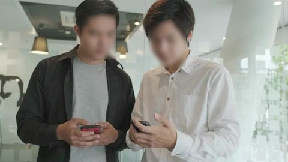
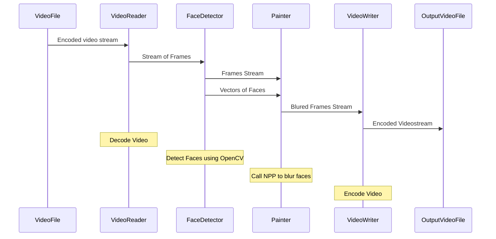

# CUDA at Scale Independent Project

This is the week 5 project of the [Course 3 of 4 in the GPU Programming Specialization by Johns Hopkins University](https://www.coursera.org/learn/cuda-at-scale-for-the-enterprise/home/info)

## Project Description

Blur faces in videostream

| Source Video Frame | Video Frame with Blured Faces |
:-------------------------:|:-------------------------:
  |  

## Quick start

- `git clone https://github.com/mer1in/jhGPUPSc3w5.git && cd jhGPUPSc3w5 && ./init.sh`
- `./run.sh`

The `init.sh` script sets up all dependencies and builds required library.

The `run.sh` compiles and links the actual application and runs it with video files from **./video/** folder. Results can be found in **./out/** directory

Execution was tested on [the machine provided in the laboratory](https://www.coursera.org/learn/cuda-at-scale-for-the-enterprise/ungradedLab/8cJV3/npp-box-filter-laboratory/lab)

## Usage

`./videoHideFaces <input_file> <output_file> [--dump-input] [--dump-blured]`
- `input_file` video file to be processed, required
- `output_file`    name of a file to write results to, required
- `--dump-input`   write each input frame to a file named **output_file**-input-**frame-number**.jpg
- `--dump-blured`  write each blured frame to a file named **output_file**-blured-**frame-number**.jpg

#### Example:
`./videoHideFaces ./video/F01.mp4 out/F01.mp4 --dump-input --dump-blured`

## Flow explained



## Code Organization

### folders

- src - sources
- opencv - openCV Library, included as a submodule
- opencv_contrib - openCV extra modules, submodule
- ffmpeg - video manipulation framework, submodule
- x264 - libx264 encoder library, submodule
- assets - face detection DNNs
- video - video sources
- out - execution artifacts
- cmake - cmake routines required for build

### files

- [CMakeLists.txt](./CMakeLists.txt) - cmake build recipe
- [README.md](./README.md) - this file
- [init.sh](./init.sh) - script to initialize build environment, runs ~30 minutes
- [monitor.sh](./monitor.sh) - simple CI script, instantly watches for changes in repo and rebuilds if changed
- [run.sh](./run.sh) - build and run

## Prerequisites

- [npp](https://developer.nvidia.com/npp) - if you're using computer provided by course platform then this dependency is already installed

## Dependencies / third party components / RTFMs

- [ffmpeg](https://www.ffmpeg.org/) included as submodule, this dependency is built by `init.sh` script
  - [libx264](https://code.videolan.org/videolan/x264)
  - [hints in building ffmpeg](https://trac.ffmpeg.org/wiki/CompilationGuide/Ubuntu)
- video/\* samples were taken from <a target="_blank" href="http://www.videezy.com/">Free Stock Videos by Videezy</a>  and downscaled with\
 ```for f in `ls|grep mp4`; do ffmpeg -i $f -vf scale=480:-1 video/$f ; done```
- [npp documentation](https://docs.nvidia.com/cuda/npp/index.html)
- [Building a face detector with OpenCV in C++](https://medium.com/analytics-vidhya/building-a-face-detector-with-opencv-in-c-8814cd374ea1)
- https://opencv.org/
